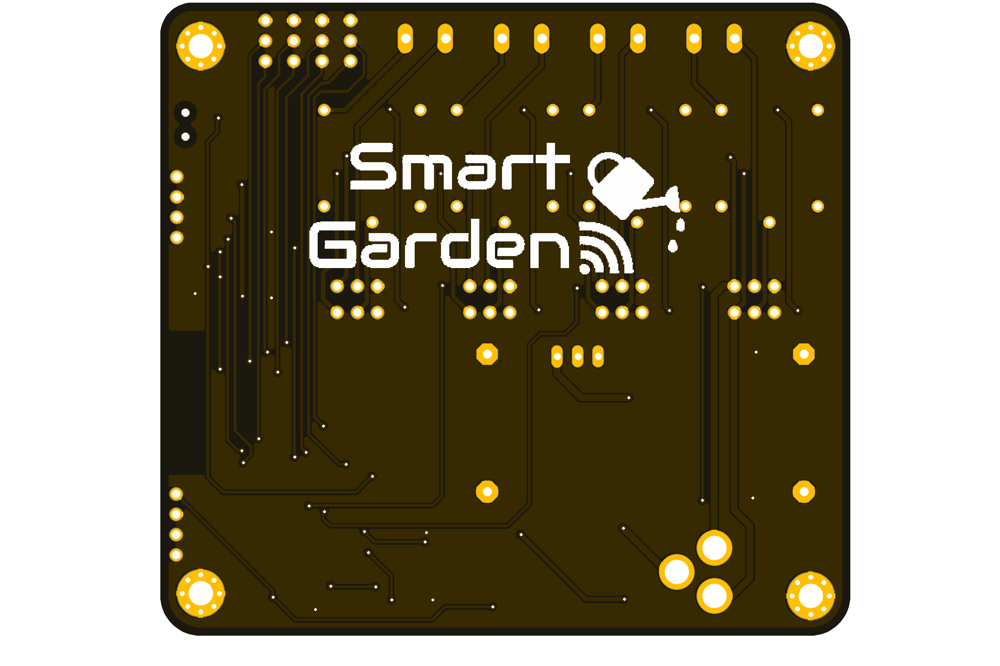

[![GitHub Release][releases-shield]][releases]
[![License][license-shield]](LICENSE)

[![Project Maintenance][maintenance-shield]][maintenance]
[![BuyMeCoffee][buymecoffee-shield]][buymecoffee]

# Smart Garden
The Smart Smart Garden provides an ESP32 based interface for controlling up to 4 relays. The output of the relays is a 24VAC or a selectable 5-24VDC power, mainly targeted to control sprinkles.

   
      

## Project tree
---
<li><a href="./Design/">Design</a></li>
<li><a href="./Documentation/">Documentation</a></li>

<li><a href="./README.md">README.md</a></li>

[releases-shield]: https://img.shields.io/github/release/JGAguado/Smart_Garden.svg?style=for-the-badge
[releases]: https://github.com/JGAguado/Smart_Garden/releases

[license-shield]: https://img.shields.io/badge/License-CC%20BY--NC--SA%204.0-lightgrey.svg?style=for-the-badge

[maintenance-shield]: https://img.shields.io/badge/maintainer-J.%20G.%20Aguado-blue.svg?style=for-the-badge
[maintenance]: https://github.com/JGAguado

[buymecoffee-shield]: https://img.shields.io/badge/buy%20me%20a%20coffee-support-yellow.svg?style=for-the-badge
[buymecoffee]: https://www.buymeacoffee.com/J.G.Aguado
