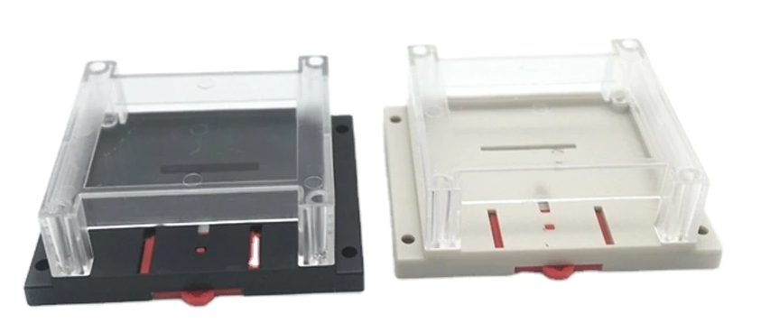

💡 Details
===============

Power
--------
The |Product| can be powered in two ways: through the USB-C (only for programming and testing purposes) **or** through the AC Input, but not simultaneously. 

AC Power
^^^^^^^^^^^^^

The |Product| is powered directly through a Power Jack connector located on the bottom part of the board. The recommended 
size for the input connector is a 5.5mm (outer) and 2.1mm (inner) diameter power jack.

As the |Product| was designed to control sprinkles, it is expected to be powered with a 24VAC source, such as the **NIMO YL15-2401000 220VAC to 24VAC (1A)**. 

Alternatively, and if you are not expecting to control AC sprinkles, powering the board from any VDC in the range of 12-24V is posible as well.

.. Note::
    Choose always a power supply that can deliver the same or more (within the :doc:`specs` limits) voltage than your loads (solenoid valves/ pumps), as the DC/DC 
    regulator operates as a step-down converter.

The Power :term:`LED` indicator is disconnected by default, under normal working circumstances this would be an unnecesary energy waste. For enabling it you just need to solder the jumper placed side the silkscreen bulb, located on the bottom layer. For more info, visit the Jumpers section.

I/O
-----------
The |Product| supports up to 4 independent *relay outputs*, 4 *analog inputs* and anoter 4 *digital inputs/outputs*:

.. _pinout:

.. list-table:: Pinout table
    :widths: 10 10
    :header-rows: 1

    * - GPIO
      - Name
    * - 1
      - In 1
    * - 2
      - In 2
    * - 3
      - In 3
    * - 4
      - In 4
    * - 5
      - Out 1
    * - 6
      - Out 2
    * - 7
      - Out 3
    * - 8
      - Out 4
    * - 10
      - Relay 1
    * - 11
      - Relay 2
    * - 12
      - Relay 3
    * - 13
      - Relay 4

Relays
^^^^^^^^^^^^^^^^
Each one of the relays can only be on True/False states. However, the type of output voltage that the relays deliver can be 
assigned previously via hardware: 

Next to the power jack connector, there are 4 slide switches that configure each of the 4 outputs as DC or AC:

* If the *24 VAC* is selected, the controlled relay will output 0 or 24VAC. This is the way to control solenoid valves such as the `Hunter PGV series <https://www.hunterindustries.com/en-metric/node/28321>`_ 
  or the `Gardena's Irrigation Valve 24V <https://www.gardena.com/int/products/watering/water-controls/24-v-irrigation-valve/900904101/>`_ 

* If the *VDC* is selected, the controlled relay will output 0 or a fixed regulated 12 VDC voltage. 

The connection port of each of the outputs is located on the top left part of the board and is done through 
3.5mm screw terminals. The polarity of the connection (for DC operations) is defined on the PCB silkscreen.

As an indicator that the relay is being activated, a :term:`LED` will turn on/off, depending on the relay's state.

.. figure:: images/assembly/outputs.png
    :align: right
    :figwidth: 300px

From left to right, the pin definion of each output is:

:Relay 1: *GPIO10*
:Relay 2: *GPIO11*
:Relay 3: *GPIO12*
:Relay 4: *GPIO13*

Auxiliar inputs/outputs:
^^^^^^^^^^^^^^^^^^^^^^^
The connection port for these auxiliar pins is located on the top right part of the board and is done through 
2.54 pins.

These pins are grouped in 4 sets, containing: 

:Auxiliar 1: *GND*, *GPIO5* & *GPIO1*
:Auxiliar 2: *GND*, *GPIO6* & *GPIO2*
:Auxiliar 3: *GND*, *GPIO7* & *GPIO3*
:Auxiliar 4: *GND*, *GPIO8* & *GPIO4*

.. Error::
    The silkscreen on the board is wrong, the right one should be:

    .. figure:: images/assembly/digital_io_fixed.png
        :align: right
        :figwidth: 200px

.. Hint::
    These pins can be used to read if a pushbutton has been pressed and therefore activate the LED ring on the pushbutton, or simply to read any additional sensor like an analog soil moisture probe.

Communications
-----------
In addition to the I/O mentioned before, there is also a direct connection to:

:term:`IIC` (:math:`I^2C`) bus:
^^^^^^^^
:SDA: *GPIO33*
:SCL: *GPIO34*

Serial bus:
^^^^^^^^^^^
:Tx: *U0TXD*
:Rx: *U0RXD*

Enclosure
---------
The |Product| has been designed to fit in the electronics enclosure LK-PLC01,
compatible with DIN rails and screws, and it is recommended for indoors only.

:External size: 115x90x40mm
:Material: ABS Plastic
:Color: Transparent cover, black or beige base