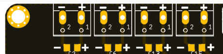
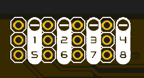
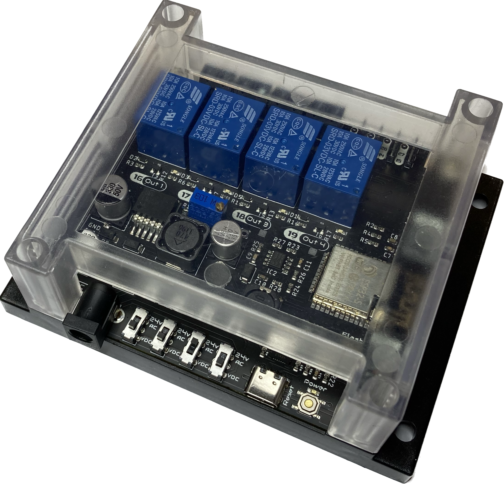

Getting started
===============

Soldering 
----------
.. Important::
    Please note that some components in this board need to be soldered.

If you have never soldered or you want to improve your soldering techniques I recommend you 
the `Adafruit Guide To Excellent Soldering <https://learn.adafruit.com/adafruit-guide-excellent-soldering>`_

For better understanding where is located each component on the board check out the :ref:`pcb` layout 
with the interactive :term:`BOM`.

Powering
--------
.. Caution::
    Power the board only after making all the connections

The |Product| is powered directly through a Power Jack connector located on the bottom part of the board. The recommended 
size for the input connector is a 5.5mm (outer) and 2.1mm (inner) diameter power jack.

As the |Product| was designed to control sprinkles, it is expected to be powered with a 24VAC source, such as the **NIMO YL15-2401000 220VAC to 24VAC (1A)**. 

Alternatively, and if you are not expecting to control AC sprinkles, powering the board from any VDC in the range of 12-24V is posible as well.

.. Note::
    Choose always a power supply that can deliver the same or more (within the :doc:`specs` limits) voltage than your loads (solenoid valves/ pumps), as the DC/DC 
    regulator operates as a step-down converter.

I/O
-----------
The |Product| supports up to 4 independent *analog outputs*  and 8 *digital inputs/outputs*:

.. _pinout:

.. list-table:: Pinout table
    :widths: 10 10 10 20
    :header-rows: 1

    * - GPIO
      - Input
      - Output
      - Name
    * - 4
      - ✅
      - ✅
      - Auxiliar 1A
    * - 5
      - ✅
      - ✅
      - Auxiliar 2A
    * - 14
      - ✅
      - ✅
      - Auxiliar 3A
    * - 15
      - ✅
      - ✅
      - Auxiliar 4A
    * - 16
      - ❌
      - ✅
      - Output 1
    * - 17
      - ❌
      - ✅
      - Output 2
    * - 18
      - ❌
      - ✅
      - Output 3
    * - 19
      - ❌
      - ✅
      - Output 4
    * - 23
      - ✅
      - ✅
      - Auxiliar 1B
    * - 25
      - ✅
      - ✅
      - Auxiliar 2B
    * - 26
      - ✅
      - ✅
      - Auxiliar 3B
    * - 27
      - ✅
      - ✅
      - Auxiliar 4B

Outputs:
^^^^^^^^^^^^^^^^
Each one of these outputs are individually controlled through relays, so the can only be on True/False states. However, the type of output voltage can be 
assigned previously via hardware: 

Next to the power jack connector, there are 4 slide switches that configure each of the 4 outputs as DC or AC:

* If the *24 VAC* is selected, the controlled relay will output 0 or 24VAC. This is the way to control solenoid valves such as the `Hunter PGV series <https://www.hunterindustries.com/en-metric/node/28321>`_ 
  or the `Gardena's Irrigation Valve 24V <https://www.gardena.com/int/products/watering/water-controls/24-v-irrigation-valve/900904101/>`_ 

* If the *VDC* is selected, the controlled relay will output 0 or a regulated VDC voltage. This DC voltage can be adjusted through the blue trimmer in a range of 3.3 up to the input
  voltage through the jack connector. This is the way to control DC water pumps up to 10W. 

The connection port of each of the outputs is located on the top left part of the board and is done through 
3.5mm screw terminals. The polarity of the connection (for DC operations) is defined on the PCB silkscreen.

From left to right, the pin definion of each output is:

:Output 1: *GPIO16*
:Output 2: *GPIO17*
:Output 3: *GPIO18*
:Output 4: *GPIO19*

Digital inputs/outputs:
^^^^^^^^^^^^^^^^^^^^^^^
The connection port of these pins is located on the top right part of the board and is done through 
2.54 pins.

These pins are grouped in 4 sets, containing: 
:Auxiliar 1: *GND*, *GPIO23* & *GPIO4*
:Auxiliar 2: *GND*, *GPIO25* & *GPIO5*
:Auxiliar 3: *GND*, *GPIO26* & *GPIO14*
:Auxiliar 4: *GND*, *GPIO27* & *GPIO15*

.. Hint::
    These pins can be used to read if ring led powered pushbuttons has been pressed.

Analog inputs:
^^^^^^^^^^^^^^
In order to provide a feedback of the DC regulated voltage that would be output, pin *GPIO32* offers a measurement of the real voltage once regulated.

Since it is designed in a voltage divider configuration for avoiding the input read above 3.3V to the microcontroller, the correspondent equation for obtaining 
the real voltage is as follows:

:math:`V_{real} = \frac{11.2k\omega}{1.2k\omega} \cdot V_{measured} = 9.33 \cdot V_{measured}`

Communications
-----------
In addition to the I/O mentioned before, there is also a direct connection to:

:term:`IIC` (:math:`I^2C`) bus:
^^^^^^^^
:SDA: *GPIO21*
:SCL: *GPIO22*

Serial bus:
^^^^^^^^^^^
:Tx: *GPIO1*
:Rx: *GPIO3*

Enclosure
---------
The |Product| has been designed to fit in the electronics enclosure LK-PLC01,
compatible with DIN rails and screws, and it is recommended for indoors only.

:External size: 115x90x40mm
:Material: ABS Plastic
:Color: Transparent cover, black or beige base