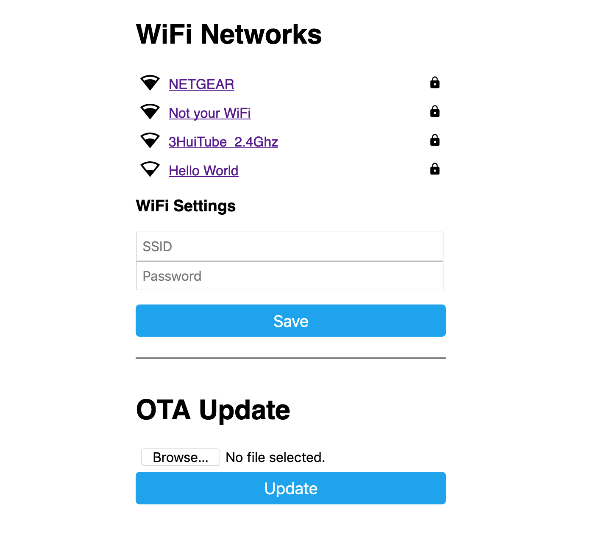

Programming
===========

There are many firmwares supported with the |Product| (almost any supporting the ESP-32). Some of the tested working are: 
 * ESPHome
 * Tasmota
 * Arduino

In any case scenario, and regardless you are using the USB port or the Serial port for programming it, you
will first need to enter the board into flashing mode. For that, press and hold the *Flash* pushbutton
while you reset the board (pressing once the *Reset* pushbutton).

.. Caution::
    When flashing the board, make sure its only powered by the USB/Serial port.

.. Note::
    It is possible that after flashing your board and while rebooting, the ESP-32 has some issues to boot. This is due to a higher 
    demmand of power while

ESPHome
---------
`ESPHome <https://esphome.io>`_ is a well known platform for programming ESP-based devices 
with a very little effort. It is configured via YAML files and supports a wide range of functionalities
and sensors.

.. Important::
    For using ESPHome, and all its funcionalities, you need to have a `Home Assistant <https://www.home-assistant.io>`_ instance running
    in the same network as your |Product|.

    
The |Product| already comes with an embeded version of ESPHome, that would only require an :term:`OTA` update
to get it ready to work in your network:

1. Power the board, and let it run for 1-2 minutes. When the board cannot connect to a WiFi network, it will 
   create a fallback hotspot.
2. Use a smartphone or tablet and go to the WiFi settings, connect to the recently created *Smart-Garden* hotspot with the password *SmartGarden*.
3. Access to the captive portal and open the browser if doesn't pop up automatically.
4. Enter your network setttings and press *Save*.

Now, your ESPHome device is ready to be found by Home Assistant in your network. Add it from the ESPHome section to add 
and edit a customized configuration file.

As an example of such configuration file (and the one flashed on the factory settings of the |Product|) 
with all the :term:`I/O`:

.. literalinclude:: files/configuration.yaml
   :language: yaml
   :linenos:

Tasmota
--------
As an alternative easy-to-use and still powerfull, you can flash Tasmota into the |Product| directly. This option is higly recommendable if you want to want to have an 
Alexa compatible device (based on a Hue emulated bridge) without the need of a full Home Assistant setup.

The easiest process of flashing Tasmota into your |Product| goes as follows:

1. Plug the |Product| into your computer's USB.
2. Go to the `Tasmota Web Installer <https://tasmota.github.io/install/>`_
3. Follow the process selecting ESP32 as device and select the correct port (remember to enter the board into flashing mode).
4. After the process is completed, press the reset button. 
5. Once rebooted, the |Product| will create a wifi hotspot containing the name *Tasmota*. Connect and enter your WLAN setup on the captive portal. 
6. Get the IP assigned to the board (check your router's connected devices) and enter it into your browser for accessing to the Tasmota's WebUI. 

Now you can customize your board as you want. Let's first assign the output class '*Relay*' to the corresponding outputs 16, 17, 18 and 19. 

.. admonition:: Alexa integration
    If you want Alexa to directly recognize your |Product| to directly controle each output through voice controls, go to *COnfiguration -> 
    Configure Other* and select the option 'Hue Bridge multi device' emulation.

In addition, some of these other commands can be entered through the **Console** (*Consoles -> Console*):

 * **Timed output**: With the command ``PulseTime3 300`` you can make that the output 3 turns off after 5 minutes (300s). This option is highly 
 indicated as a safety feature to prevent your home to get floaded.

 * **Interlocks**: With the command ``interlock on`` you can make that ONLY one of the 4 outputs can become active at the same time . 
 For selecting the group of the for relays just use the command ``interlock 1,2,3,4``. 
 This mode can become usefull when your home's water pressure is not high enough for holding more than one watering zone at the same time.

In any case, you can find these and much more commands to customize your Tamota's flashed |Product| on the `official Tasmota documentation <https://tasmota.github.io/docs/Commands/>`_

Arduino
--------
If you are still interested in programming directly with the Arduino IDE, the procedure is no 
different than with any other ESP32 devices:

1. Open the Arduino IDE and go to File -> Preferences option.
2. Add to the *Additional Boards Manager URSLs* the url:

.. parsed-literal::

    https://raw.githubusercontent.com/espressif/arduino-esp32/gh-pages/package_esp32_index.json

3. Close the preferences and open in the menu Tools -> Board -> Boards Manager
4. Search for *esp32* and install it. This might take some time
5. Now you can select the board *ESP32 Dev Module* as the target board. Leave the rest of parameters 
   by default.
6. Select the correct port and remember to enter the board into flashing mode before uploading the sketch.

