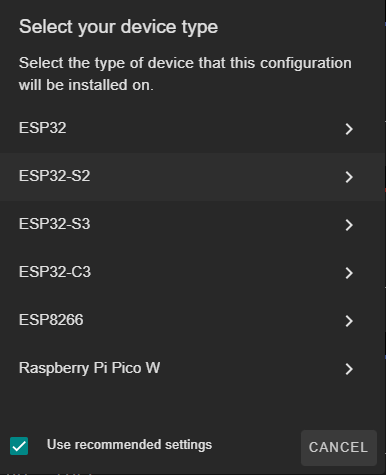
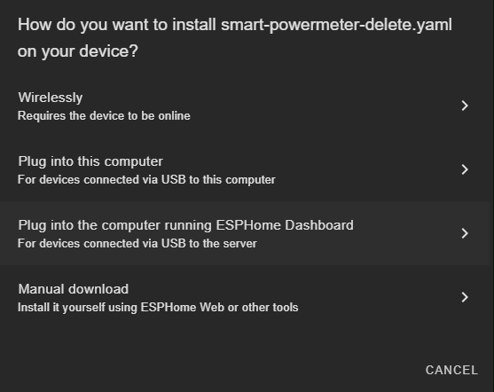
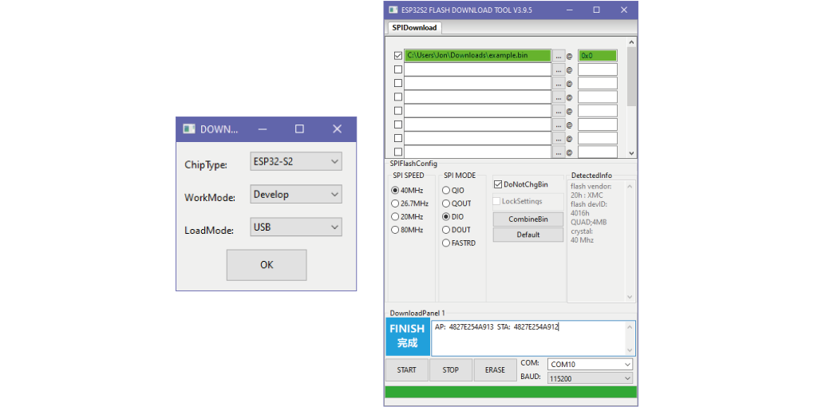
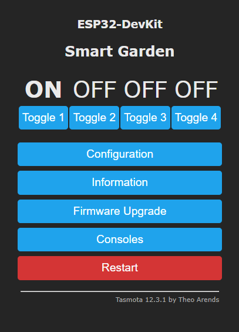

💻 Programming
===============

There are two main programming methods supported and tested with the |Product|: 

 * ESPHome
 * Tasmota
 * Arduino

In any case, and if you are using the USB port or the Serial port for programming it, you
will first need to enter the board into flashing mode: press and hold the *Flash* pushbutton
while you reset the board (pressing once the *Reset* pushbutton).

.. Caution::
    When flashing the board, make sure its only powered by the USB/Serial port.
    
ESPHome
---------
`ESPHome <https://esphome.io>`_ is a well known platform for programming ESP-based devices 
with a very little effort. It is configured via YAML files and supports a wide range of functionalities
and sensors.

.. Important::
    For using ESPHome, and all its funcionalities, you need to have a `Home Assistant <https://www.home-assistant.io>`_ instance running
    in the same network as your |Product|.

    
The |Product| comes raw, without any firmware by default, therefore, you will need to flash it for first time. There are many ways to flash 
your ESPHome device (`locally <https://esphome.io/guides/getting_started_command_line.html>`_, `ESPHome Web <https://web.esphome.io>`_), but 
the one I strongly recommend is the one through the `ESPHome Add-on for Home Assistant <https://esphome.io/guides/getting_started_hassio.html>`_:

1. Make sure your ESPHome Add-on for HA is up to date and working. 
2. Add a new device, enter the name you want (like *Smart-Garden*), and skip the next step.
3. Select the *ESP32-S2* as the device type, skip the last step (installation). You will have created a provisional first configuration YAML file.

4. Open the recently created file and replace the content with the example configuration. 

.. Note:: You might need to keep the encription keys *OTA* and *API*

.. literalinclude:: files/configuration.yaml
   :language: yaml
   :linenos:

5. Click on install, make sure that the the board is connected via the USB-C (and that it is into flashing mode, see up in this guide) to the device running the Home Assistant (in my case a Raspberry Pi) before selecting the mode of installation.

6. Select the Serial port and let it run, it might take some minutes. 
7. Once it's done, you will have to exit the flashing mode: press the *Reset* pushbutton once. 

Now, your ESPHome-based |Product| should be ready to log data and stream it to your Home Assistant. Note that the current configuration is just an example and you can customize it at your will, including the calibration. 

Flash Tools
^^^^^^^^^^^^
If you want to deploy an ESPHome already compiled *.bin* image, you can use Espressif's official `Flash Download Tools <https://www.espressif.com/en/support/download/other-tools>`_ to upload it into your |Product|. 
If you downloaded the *.bin* from ESPHome or you compiled any compatible image, you can upload it through this tool. Just make sure the address is set to `0x0` and the `DoNotChgBin` option is checked:

Tasmota
--------
As an alternative easy-to-use and still powerfull, you can flash Tasmota into the |Product| directly. This option is higly recommendable if you want to want to have an 
Alexa compatible device (based on a Hue emulated bridge) without the need of a full Home Assistant setup.

The easiest process of flashing Tasmota into your |Product| goes as follows:

1. Plug the |Product| into your computer's USB.
2. Go to the `Tasmota Web Installer <https://tasmota.github.io/install/>`_
3. Follow the process selecting ESP32-S2 as device and select the correct port (remember to enter the board into flashing mode).
4. After the process is completed, press the reset button. 
5. Once rebooted, the |Product| will create a wifi hotspot containing the name *Tasmota*. Connect and enter your WLAN setup on the captive portal. 
6. Get the IP assigned to the board (check your router's connected devices) and enter it into your browser for accessing to the Tasmota's WebUI. 

Now you can customize your board as you want. Let's first assign the output class '*Relay*' to the corresponding outputs 10, 11, 12 and 13. 

In addition, some of these other commands can be entered through the **Console** (*Consoles -> Console*):

 * **Timed output**: With the command ``PulseTime3 300`` you can make that the relay 3 turns off after 5 minutes (300s). This option is highly indicated as a safety feature to prevent your home to get floaded.

 * **Interlocks**: With the command ``interlock on`` you can make that ONLY one of the 4 relays can become active at the same time. For selecting the group of the for relays just use the command ``interlock 1,2,3,4``. This mode can become usefull when your home's water pressure is not high enough for holding more than one watering zone at the same time.

In any case, you can find these and much more commands to customize your Tamota's flashed |Product| on the `official Tasmota documentation <https://tasmota.github.io/docs/Commands/>`_

.. admonition:: And, by the way...
    
    If you want Alexa to directly recognize your |Product| to directly controle each output through voice controls, go to *COnfiguration -> 
    Configure Other* and select the option 'Hue Bridge multi device' emulation.
    

Arduino
--------
If you are still interested in programming directly with the Arduino IDE, the procedure is no 
different than with any other ESP32 devices:

1. Open the Arduino IDE and go to File -> Preferences option.
2. Add to the *Additional Boards Manager URSLs* the url:

.. parsed-literal::

    https://dl.espressif.com/dl/package_esp32_index.json

3. Close the preferences and open in the menu Tools -> Board -> Boards Manager.
4. Search for *esp32* and install it. This might take some time.
5. Now you can select the board *ESP32S2 Dev Module* as the target board. Leave the rest of parameters 
   by default.
6. Select the correct port and remember to enter the board into flashing mode before uploading the sketch.

